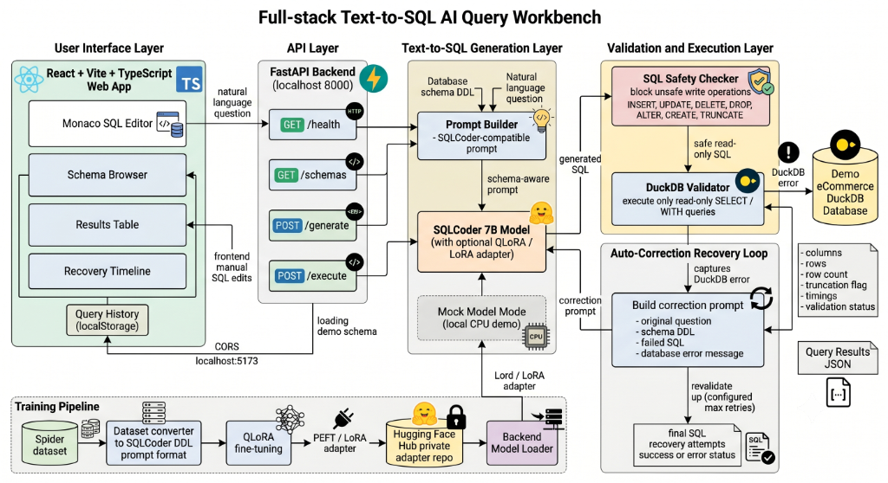
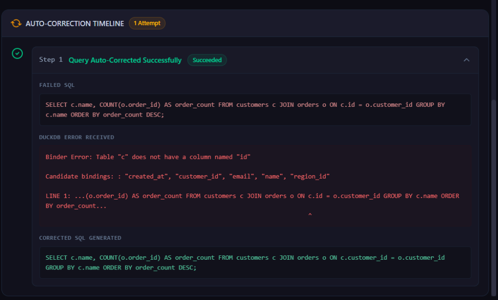
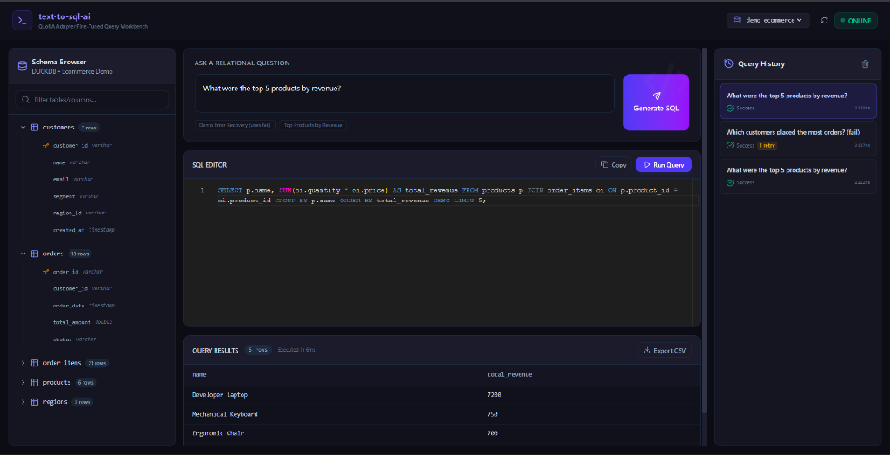

# Full-Stack Text-to-SQL AI Query Workbench

A production-ready, full-stack Text-to-SQL workbench that translates natural language English questions into SQL, validates them against a DuckDB relational database in read-only mode, and automatically corrects execution errors using a model self-correction feedback loop.



---

## 1. System Architecture

The application is structured into five distinct component layers:



1. **User Interface Layer (React + Vite + TS):** Interactive query dashboard featuring a dynamic **Schema Browser** with search filters, a **Monaco SQL Editor** with keyboard shortcuts, a **Results Table** with client-side pagination and CSV export, and a persistent local storage **Query History**.
2. **API Layer (FastAPI):** High-performance Python backend coordinating endpoints for health checks, schema listings, SQL generation, manual SQL execution, timings, and error responses.
3. **Text-to-SQL Generation Layer:** Prompt builder and inference loader. In development, it falls back to a CPU-friendly **Mock Mode** matching standard test queries. In production, it loads the quantized **SQLCoder 7B model + PEFT/LoRA adapter**.
4. **Validation and Execution Layer (DuckDB):** Protects the database by running a strict regex-based **SQL Safety Checker** (permits `SELECT`/`WITH` and blocks modification commands) and executing queries against the **Seeded eCommerce Database** in a database-enforced `read_only` connection.
5. **Auto-Correction Recovery Loop:** If a query fails DuckDB compilation or binding, the system extracts the error message, rebuilds a correction prompt, and queries the LLM again to self-correct and execute.

---

## 2. Key Features

- **Schema-Aware Prompting:** Automatically loads tables, columns, constraints, and relationships from DuckDB and converts them into standard SQLCoder DDL prompts.
- **Auto-Correction Recovery Loop:** Automatically corrects syntax and relational binding errors (like incorrect column references) on the fly, showing the step-by-step corrections in the UI.
- **SQL Safety Enforcement:** Protects database integrity by blocking keywords (`INSERT`, `UPDATE`, `DELETE`, `DROP`, `ALTER`, `CREATE`, `TRUNCATE`, `MERGE`, `COPY`, `ATTACH`, `DETACH`) and rejecting multiple statements.
- **Monaco SQL Editor:** Renders generated queries in a full editor with syntax highlighting, letting users inspect, modify, and run customized adjustments.
- **Session History:** Persists past inputs, execution durations, and statuses in browser local storage for easy reloading.
- **CSV Data Exporter:** Compiles query grids into CSV files and triggers downloads client-side.

---

## 3. Auto-Correction Timeline

When an LLM-generated SQL query fails database validation due to schema mismatches (e.g. referencing a column that doesn't exist), the system executes a correction feedback loop:



The loop proceeds as follows:
1. **Initial Execution:** The generated SQL causes a binder exception in DuckDB.
2. **Error Capture:** The backend catches the exception (e.g., `Binder Error: Table "c" does not have a column named "id"`).
3. **Reprompting:** The system builds a correction prompt combining the original question, schema DDL, failed SQL, and the exact DuckDB error string.
4. **Self-Correction:** The LLM generates a corrected query (`c.customer_id`), which the backend re-validates. Upon success, the rows are returned and the stepper details are displayed in the timeline.

---

## 4. Installation & Quickstart

Clone the repository and follow these steps to run the workbench locally in Mock mode (no GPU required).

### Step 4.1: Setup Backend & DuckDB Database
1. Navigate to the `backend/` directory:
   ```bash
   cd backend
   ```
2. Create a virtual environment and activate it:
   ```bash
   python -m venv .venv
   
   # Windows (PowerShell):
   .venv\Scripts\Activate.ps1
   
   # macOS/Linux:
   source .venv/bin/activate
   ```
3. Install the backend dependencies:
   ```bash
   pip install fastapi uvicorn pydantic pydantic-settings duckdb pytest httpx
   ```
4. Build and seed the demo DuckDB database:
   ```bash
   python data/demo/create_demo_db.py
   ```
5. Start the FastAPI backend server:
   ```bash
   uvicorn app.main:app --reload --port 8000
   ```
   The interactive API docs will be live at `http://localhost:8000/docs`.

### Step 4.2: Setup Frontend
1. Open a new terminal and navigate to the `frontend/` directory:
   ```bash
   cd frontend
   ```
2. Install the node packages:
   ```bash
   npm install
   ```
3. Start the Vite React development server:
   ```bash
   npm run dev
   ```
4. Open your browser and navigate to `http://localhost:5173`.

---

## 5. Testing & Verification

### Run Backend Unit Tests
We have a comprehensive test suite covering SQL safety rules, DuckDB validation parameters, API routing contracts, and simulated error correction:
```bash
cd backend
.venv\Scripts\python -m pytest -v
```

### Run Frontend Production Build
To verify the React project compiles successfully for production deployment:
```bash
cd frontend
npm run build
```

---

## 6. Model Training Pipeline (`/training`)

The `/training` directory contains the scripts required to fine-tune `defog/sqlcoder-7b-2` on a custom Spider dataset.

### Step 6.1: Dataset Preprocessing
Transforms Spider schema catalogs and questions into standard DDL-aware training prompts:
```bash
python training/scripts/convert_spider_to_sqlcoder.py \
    --spider_json /path/to/spider/train.json \
    --tables_json /path/to/spider/tables.json \
    --output_jsonl training/dataset_train_sqlcoder.jsonl
```

### Step 6.2: Fine-Tuning Execution
Trains a LoRA adapter on an A100 GPU using parameters defined in `configs/qlora_sqlcoder_spider.yaml`:
```bash
python training/scripts/train_qlora.py \
    --config training/configs/qlora_sqlcoder_spider.yaml \
    --dataset training/dataset_train_sqlcoder.jsonl \
    --output_adapter training/adapter_weights
```

### Step 6.3: Push to Hugging Face
Uploads finished adapter weights to a private Hugging Face repository:
```bash
python training/scripts/push_adapter.py \
    --adapter_dir training/adapter_weights \
    --repo_id your-username/sqlcoder-spider-adapter \
    --token YOUR_HF_WRITE_TOKEN
```
A Google Colab template notebook is available at `training/notebooks/finetune_sqlcoder_spider_qlora.ipynb` to run this training pipeline on a hosted cloud GPU.
